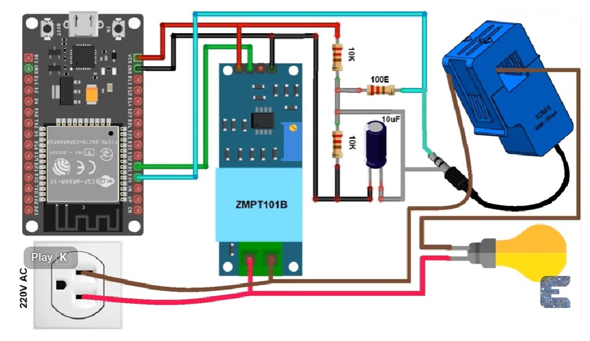
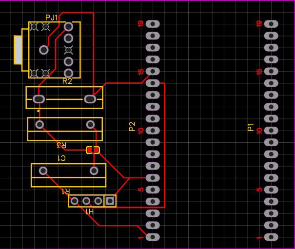
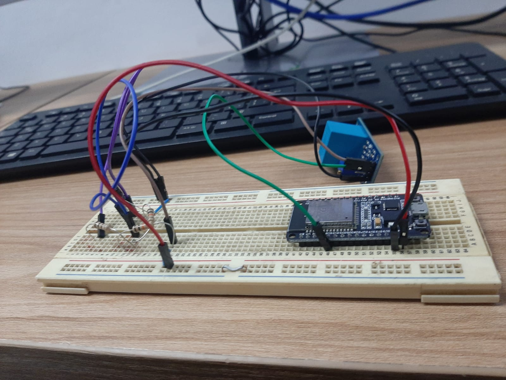

#  Memoria de Investigación — Etapa 1: Concepción, Curva de Aprendizaje y Pruebas Iniciales

> **Proyecto:** Sistema IoT de Monitoreo Analítico y Predicción de Fallas en Electrodomésticos  
> **Semillero de Investigación:** *Innovación y Mecatrónica IoT (SIMIOT)*  
> **Institución:** *Universidad Nacional de Investigación y Tecnología (UNITEC)*  
> **Autores:** *[Estudiante 1], [Estudiante 2], [Estudiante 3]*  
> **Tutor / Director:** *Ing. [Nombre del Docente]*  
> **Estado:**  Completado

---

##  1. Contexto y Justificación del Proyecto

### 1.1 Problema y Necesidad
Los electrodomésticos de uso continuo (como refrigeradores y neveras) sufren un deterioro progresivo que frecuentemente pasa inadvertido hasta que ocurre una falla crítica. Problemas como un empaque de puerta desgastado, sobrecalentamiento del compresor o variaciones anormales de voltaje incrementan exponencialmente el consumo energético y reducen la vida útil del equipo.

Existe la necesidad de un **sistema no invasivo de monitoreo en tiempo real** capaz de capturar variables físicas y eléctricas clave para alimentar, en etapas posteriores, modelos de **Inteligencia Artificial (IA)** destinados a la predicción de fallas y mantenimiento preventivo.

```text
                 ┌──────────────────────────────────────────────┐
                 │      MONITOREO DE ELECTRODOMÉSTICOS          │
                 └──────────────────────────────────────────────┘
                                      │
          ┌───────────────────────────┼───────────────────────────┐
          │                           │                           │
          │                           │                           │
┌──────────────────────┐   ┌──────────────────────┐   ┌──────────────────────┐
│ Consumo Eléctrico    │   │ Térmico / Compresor  │   │ Estado de Puerta     │
├──────────────────────┤   ├──────────────────────┤   ├──────────────────────┤
│ Voltímetro           │   │ Termocupla Tipo K    │   │ Sensor de Contacto   │
│ Amperímetro          │   │                      │   │                      │
└──────────────────────┘   └──────────────────────┘   └──────────────────────┘
```

---

## 2. Curva de Aprendizaje y Capacitación Técnica

Al inicio de la investigación, el equipo de estudiantes no contaba con experiencia previa en electrónica integrada, ruteo de tarjetas ni programación avanzada de microcontroladores. Se requirió una fase intensiva de autoestudio e investigación en los siguientes ejes:

| Eje Técnico | Conceptos / Herramientas Aprendidas | Aplicación en el Proyecto |
| :--- | :--- | :--- |
| **Electrónica Básica** | Ley de Ohm, divisores de tensión, acoplamiento DC, desacople con capacitores. | Acondicionamiento de señal para el ADC del ESP32. |
| **Microcontroladores** | Arquitectura del ESP32, entorno Arduino IDE, gestión de GPIOs y convertidores analógico-digitales. | Lectura de sensores y procesamiento inicial. |
| **Comunicaciones** | Protocolos UART, SPI, I2C y Bluetooth. | Transferencia local de datos. |
| **Diseño EDA** | Simulación de circuitos, creación de esquemáticos y ruteo en **EasyEDA**. | Diseño de la tarjeta de circuito impreso (PCB). |

---

## 3. Avances Preliminares y Validación Conceptual (Medición de Voltaje)

Durante esta fase inicial, el objetivo principal fue familiarizarse con las tecnologías básicas. Se logró recrear el circuito de medición de voltaje y corriente conectándolo únicamente mediante cable USB al puerto COM de una computadora, sin implementar conectividad inalámbrica en este punto.

### 3.1 Esquema del Circuito de Acondicionamiento

Para procesar la señal de corriente alterna (AC) mediante el ADC del ESP32 (el cual solo acepta señales de **0V a 3.3V DC**), se diseñó e implementó un circuito de offset de corriente continua.


                             
#### Descripción Técnica del Circuito:
* **Módulo ZMPT101B:** Transforma el nivel de voltaje de corriente alterna (110V/220V AC) a niveles seguros de bajo voltaje.
* **Sensor SCT-013:** Transformador de corriente no invasivo para la lectura de amperaje.
* **Acondicionamiento con Offset DC de 1.65V:** 
  $$\text{Offset DC} = 3.3\text{V} \times \left( \frac{10\text{k}\Omega}{10\text{k}\Omega + 10\text{k}\Omega} \right) = 1.65\text{V}$$
  Se utiliza un divisor de tensión ($2 \times 10\text{k}\Omega$) y un capacitor de desacople de $10\mu\text{F}$ para elevar la onda senoidal y evitar componentes negativas en el ADC.
* **Resistencia de Carga:** Resistencia de $100\Omega$ ($100\text{E}$) conectada a la salida del jack del sensor SCT-013.

---

### 3.2 Primer Acercamiento a EasyEDA (Prueba Unitaria de Voltaje)

Como parte de la curva de aprendizaje en software CAD/EDA, el equipo realizó su primer trazado de PCB enfocado únicamente en la etapa de voltaje. Este diseño sirvió como ejercicio práctico y **nunca se envió a fabricación**.

#### Diseño 2D en EasyEDA:


#### Diseño fisico inicial en protoboard:


> 💡 **Bitácora del Semillero — Lección Aprendida:**  
> Este primer modelo en EasyEDA fue crucial para entender cómo colocar footprints básicos, interconectar huellas y visualizar volumétricamente los componentes antes de intentar integrar todo el sistema.

---