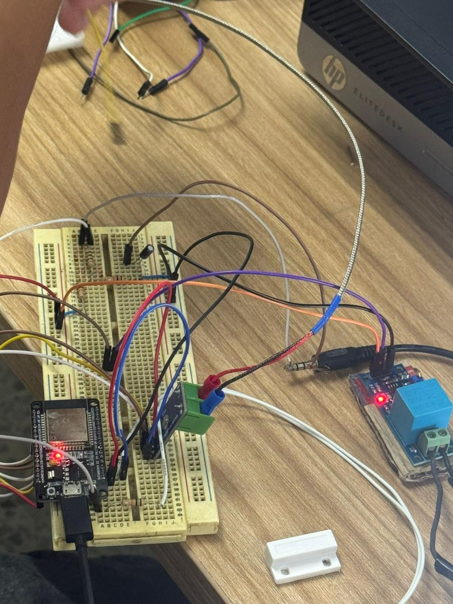
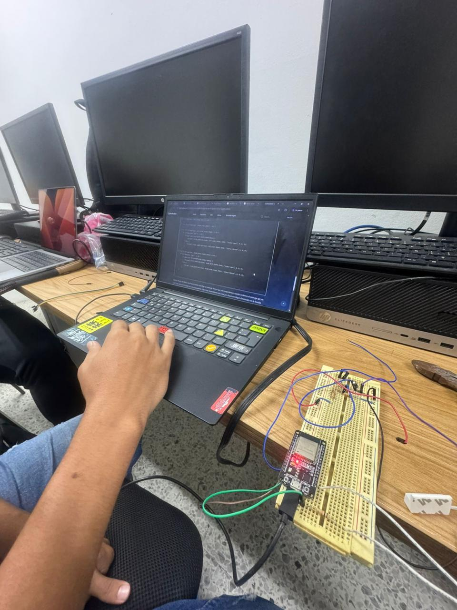
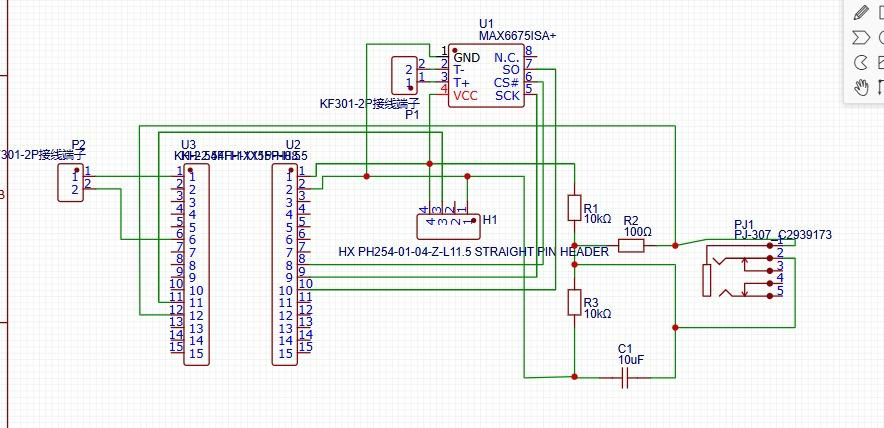
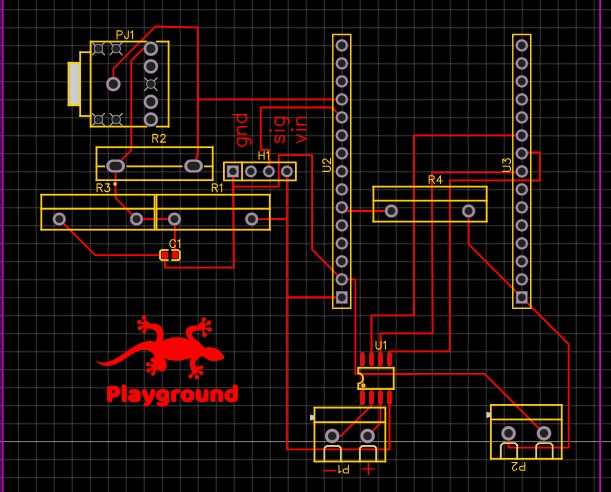
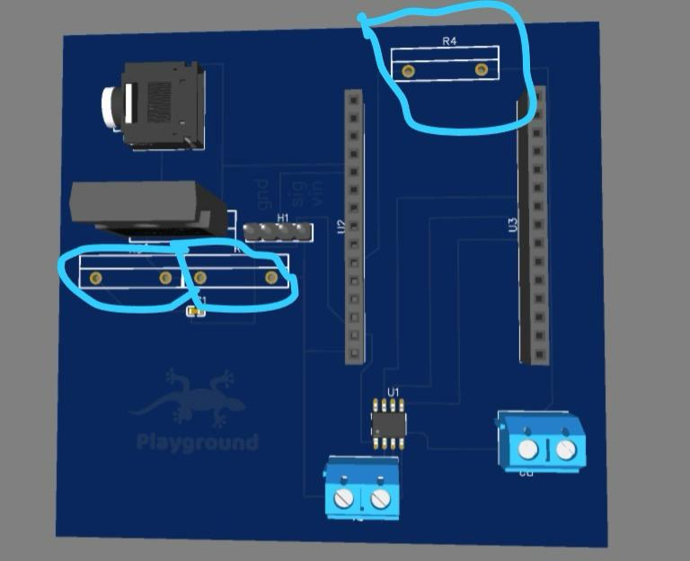
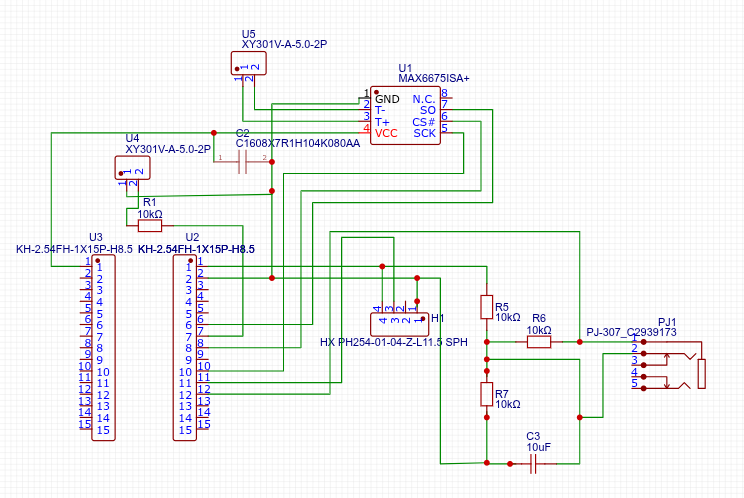
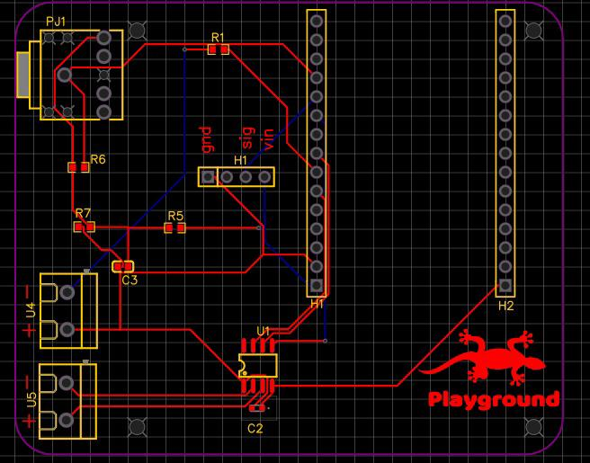
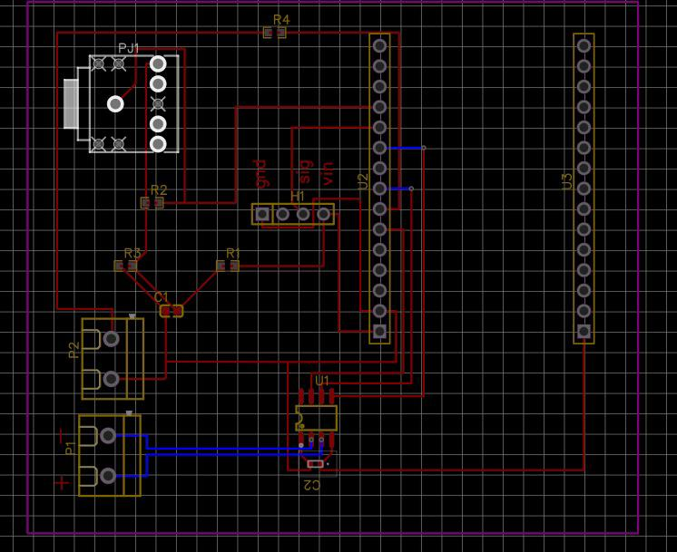

# Memoria de Investigación — Etapa 2: Prototipado en Protoboard, Depuración de Hardware y Diseño PCB

> **Proyecto:** Sistema IoT de Monitoreo Analítico y Predicción de Fallas en Electrodomésticos  
> **Semillero de Investigación:** *Innovación y Mecatrónica IoT (SIMIOT)*  
> **Institución:** *Universidad Nacional de Investigación y Tecnología (UNITEC)*  
> **Estado:** 🟡 En Desarrollo / Pruebas de Hardware Finalizadas

---

##  1. Montaje Integrado en Protoboard y Pruebas Físicas

Tras dominar las lecturas individuales por USB, se procedió a la integración total de los componentes en una protoboard: el ESP32 DevKit, el sensor de corriente SCT-013, el módulo ZMPT101B, la termocupla K con su CI transmisor **MAX6675** y el sensor magnético de contacto.

### 1.1 Pruebas Integradas de Hardware
Se realizaron múltiples sesiones de laboratorio para verificar la respuesta simultaneous de todas las señales analógicas y digitales.



### 1.2 BOM (Bill of Materials) del Prototipo

| Componente | Función Principal | Interfaz / Pinout |
| :--- | :--- | :--- |
| **ESP32 DevKit V1** | Microcontrolador (Procesamiento y Comunicaciones) | GPIOs, ADC, SPI |
| **SCT-013** | Sonda de Corriente AC no invasiva | Entrada Analógica |
| **ZMPT101B** | Módulo de Medición de Voltaje AC (110V a 5V) | Entrada Analógica |
| **MAX6675 + Termocupla K** | Circuito integrado y sensor de temperatura para compresor | Interfaz SPI |
| **Sensor Magnético (Reed Switch)** | Detección de apertura/cierre de puerta de la nevera | Entrada Digital (GPIO) |
| **Divisor de Tensión / Pasivos** | Resistencias $10\text{k}\Omega$, $100\Omega$ y Capacitores $10\mu\text{F}$ / $0.1\mu\text{F}$ | Acondicionamiento y Desacople |

---

## ⚠️ 2. Depuración de Fallas y Experiencias de Laboratorio

> 📝 **Bitácora del Semillero — Dinámica de Trabajo:**  
> El equipo trabajaba en el laboratorio únicamente **una vez por semana durante 3 a 4 horas**. Debido al poco tiempo semanal disponible, se decidió probar y repetir el circuito en protoboard durante varias semanas consecutivas. La constancia fue tal que el equipo memorizó por completo cada conexión del circuito.



### 2.1 Principales Desafíos y Errores Diagnosticados

1. 🚨 **Falla Crítica de Alimentación (Puente 3.3V - 5V):**  
   Al integrar el sensor de contacto magnético, se creó un puente accidental entre la línea de **3.3V** y la de **5V**, alimentando el sensor por una vía única incorrecta. Esto provocó sobrecalentamiento, poniendo en severo riesgo la integridad del microcontrolador.
2. 💻 **Actualización de Librerías:**  
   En la fase de software se detectaron errores de compilación causados por sintaxis obsoleta en librerías desactualizadas de los sensores. Se corrigieron migrando hacia las versiones más recientes en Arduino IDE.
3. 📉 **Ruido Analógico:**  
   Se identificó interferencia en la lectura analógica de los sensores. Como solución a futuro, se contempla la implementación de filtros pasivos/activos.

---

## 📶 3. Pruebas Iniciales de Conectividad Bluetooth (AppInventor)

Para validar la comunicación inalámbrica local sin afectar el desarrollo del hardware, se creó una aplicación provisional mediante **MIT App Inventor**:

* **Estrategia:** Transmisión de tramas de datos de forma "momentánea" para certificar que el ESP32 enviaba la señal Bluetooth correctamente hacia un smartphone.
* **Resultado:** Validación exitosa de los puertos de salida y recepción estable de datos.


```text
┌──────────────────────┐
│      ESP32 DevKit    │
│ Lectura de Sensores  │
└──────────────────────┘
           │
           ▼
   Bluetooth Classic
           │
           ▼
┌──────────────────────┐
│   App MIT AppInventor│
│   Prueba de Enlace   │
└──────────────────────┘
```


---

---

## 🎨 4. Evolución del Diseño PCB en EasyEDA

El paso de la protoboard a la tarjeta de circuito impreso (PCB) requirió un proceso iterativo de diseño, retroalimentación y corrección de errores de ingeniería.

### 4.1 Primer Esquemático y Diseño PCB Integrado (Versión con Errores Térmicos)
Se asignaron los pines libres del ESP32 para cada componente (pines D25, D33 y D32 mapeados como 8, 9 y 10 de la fila de pines del lado derecho del esquematico).

#### Esquemático v1:


#### Layout v1 (Error de Ubicación de Resistencias):


> 💡 **Bitácora del Semillero — Error Térmico:**  
> En esta primera versión se ubicó una resistencia directamente **debajo de los pines del ESP32**. Tras investigar y comprender que las resistencias generan calor por disipación, el equipo identificó que esto podría recalentar o dañar el microcontrolador. Además, el diseño inicial utilizaba simples orificios para soldar en lugar de footprints normalizados.

---

### 4.2 Segundo Modelo (Corrección Térmica y Limitación de Capa Única)

Se desplazaron las resistencias hacia la parte superior de la placa para disipar el calor lejos del microcontrolador.



> 💡 **Bitácora del Semillero — Limitación de Capa Única:**  
> En este punto, el equipo desconocía la existencia de PCBs multicapa y trabajaba en una sola capa de cobre (Single Layer). Esto obligaba a separar exageradamente los componentes para evitar que las pistas se cruzaran.

---

### 4.3 Esquemático Definitivo (Capacitor de Desacople C2)

Gracias a la tutoría del docente a cargo, se introdujeron mejoras avanzadas en el esquemático final:
* Adición del capacitor de desacople **C2** ($0.1\mu\text{F}$) conectado directamente al módulo **MAX6675** para estabilizar la lectura de la termocupla K.



---

### 4.4 Prototipo Intermedio Multicapa (Uso de Vías)

El docente instruyó al equipo sobre la fabricación de tarjetas de dos capas (*Top/Bottom Layer*).



> 💡 **Bitácora del Semillero — Descubrimiento de las Vías (*Vias*):**  
> Al principio, el equipo creía que bastaba con trazar una línea azul (capa inferior) sobre una roja (capa superior) para que se conectaran automáticamente. Con la práctica en EasyEDA, aprendieron a utilizar las **Vías** (orificios metalizados de interconexión entre capas), lo que permitió ordenar el circuito sin necesidad de distanciar tanto los módulos.

---

### 4.5 Modelo Final de PCB Aprobado para Producción

Tras ajustar la posición de las borneras/clemas (`P1`, `P2`), el jack `PJ1` y optimizar la red de pistas, se obtuvo el diseño final definitivo.



#### Mejoras del Modelo Definitivo Enviado a Producción:
* **Distribución Limpia:** Excelente organización espacial para facilitar la soldadura manual y el acople de componentes físicos.
* **Aislamiento Térmico Total:** Resistencias y componentes de potencia alejados del zócalo del ESP32.
* **Ruteo Eficiente:** Integración exitosa de capas múltiples mediante vías metalizadas.

---